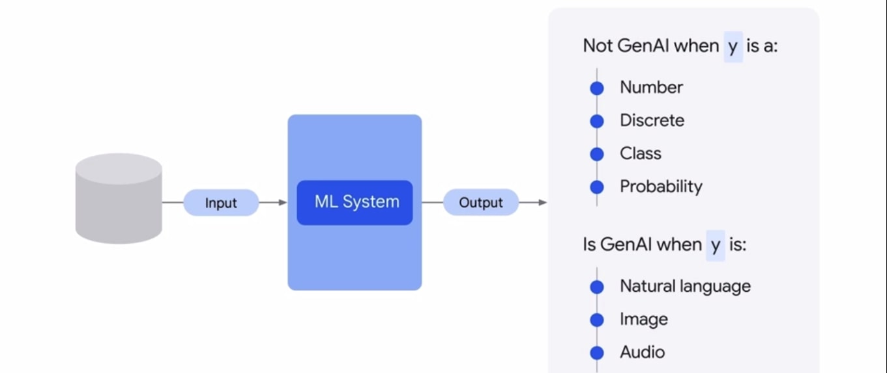
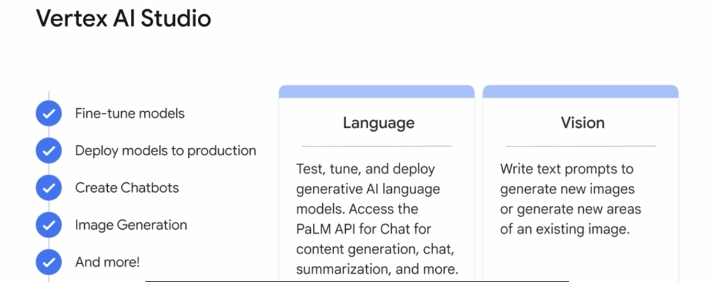

## Introduction to Generative AI
    - Agenda:
        1. Define Generative AI
        2. Explain how generative AI works
        3. Describe Generative AI Model Types
        4. Describe Generative AI Applications

##  Define Generative AI
- Generative AI is a type of Artificial Intelligence technology that can produce various types of contents - including text, imagery, audio, and synthetic data.

## What s AI? And what is the difference between AI and ML?
- AI is a discipline like Physics is a discipline of Science.
- AI is a branch of Computer Science that deals with the creation of intelligent agents, and are systems that can reason, learn, and act autonomously.
- Essentially, AI has to do with the theory and methods to build machines that think and act like humans.

## What is MAchine Learning?
- ML is a subfield of AI.
- It is a program or system that trains a model from input data.
- The trained model can make useful predictions from new (never-before-seen) data drawn from the same one used to train the model.
- Basically, it means that ML gives computer the ability to learn without explicit programming.

## How ML models looks like?
- Unsupervised ML model
- Supervised ML model

- Difference b/w these two is that Supervised ML model has lable.

- So, Labeled data is a data that comes with a tag, like a name, a type, or a number.
- Unlabeled data is a data that comes with no tags. 

## Supervised ML model
- Supervised learning implies the data is already labeled. In supervised learning we are learning from past examples to predict future values.

## Unsupervised ML model
- Unsupervised learning implies the data is not labeled. Unsupervised prblems are all about looking at the raw data, and seeing if it naturally falls into groups.

## Deep Learning is a subset of ML
- AI
- ML
- Deep Learning

    -- Machine Learning
    -- Supervised Learning
    -- Unsupervised Learning
    -- Reinforcement learning
    -- Deep learning

## Deep learning
- Deep Learning is a type of ML that uses Artificial neural networks, allowing them to process more complex patterns that traditional machine learning.

- "Artificial neural networks" are inspred by human brain.
- neural networks can use both labeled and unlabeled data
- this is called semi-superised learning.
- In semi-superised learning, a neural n/w is trained on a small amount of labelled data and a large amount of unlabelled data.
- The labelled data helps the neural n/w to learn the basic cocepts of the task, while the unlabelled data helps the neural n/w to generalize to new examples.

#### Generative AI is a subset of Deep Learning.
- Meaning it uses Artificial neural n/ws can process both labelled and unlabelled data, using supervised, unsupervised, and semi-supervised methods.

## Large Language Models (LLM)
- LLMs are also a subset of deep learning.

## Deep Learning Model Types
- Deep Learning Models or Machine Learning models in general can be divided into two types:
1.  **Discriminative**

    -  A discriminative model is a type of model that is used to classify or predict labels for data points.
    - A discriminative models are typically trained on a dataset of labeled data points.
    - And they learn the relationhip b/w the features of the data points and the labels.
    - So, once a discriminative model is trained, it can be used to predict the label for new data points.

2. **Generative**

    - A generative model generates new data instances based on a learned probability distribution if existing data.
    - generative models geneartes new content.

    **Example**
    

    To summarize, generative models can generate new data instances, and discriminative models discriminate b/w different kinds of data instances.

    

    The top image shows the traditional ML model.

    ## How to check if a model is a Generative AI model or not

    

    ## What is Generative AI?

    - GenAI is a type of AI that creates new content based on what it has learned from existing content.
    - The process of learning from existing content is called training and results in the creation of a statistical model.
    - When given a prompt, GenAI uses this statistical model to predict what an expected response might be- and this geneartes new content.

    ## Geneartive Language Model
    - Geneartive Language Model learn about patterns in language through training data.
    Then, given some text, they predict what comes next.

    ## Hallucinations
    

    ## What is a Prompt
    
    - A prompt is a short piece of text that is given to the LLM as input, and it can be used to control the o/p of the model in the variety of ways.

    ## Prompt Design

    - Prompt Design is a proces of creating a prompt that will generate the desired o/p from a LLM.

    ## Model Types

    1. **text-to-text**

    

    2. **text-to-image**

    

    3. **text-to-video and text-to-3D**
    
    

    4. **text-to-task**

    

    ## Foundational Model

    - Foundational Model is a large AI model pre-trained on a vast quantity of data "designed to be adapted" or (fine-tuned) to a wide range of downstream tasks, such as sentiment analysis, image captioning, and object recognition.

    - Foundational Model have the potential to revolutionize many industries, including healthcare, finance, and customer service.

    - They can even be used to detect fraud and provide personalized customer support.

    

    ## Model Garden: Vertex AI Foundation Models

    - If looking for Foundation Models, Vertex AI offers a Model Garden that includes Foundation Models.

    

    ## GenAI Landscape

    

    ## 3 ways to help Google cloud can help you get more out of GenAI

        1. VERTEX AI STUDIO
            - Vertex AI Studio lets you quickly explore and customize generative AI models that you can leverage in your applications on Google Cloud.

            - Vertex AI Studio helps developers create and deploy generative AI models by providing a variety of tools and resources that make it easy to get started.

    

    - Vertex AI Search and Conversation crates Generative AI apps with little or no coding and no prior machinne learning experience.

    - Vertex AI can help you create your own:
        1. Chatbots
        2. Digital assistants
        3. Custom search engine
        4. Knowledge bases 
        5. Training Applications etc.